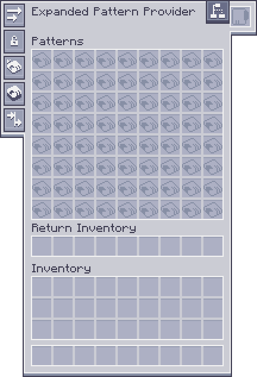

---
navigation:
  parent: expandedae-index.md
  title: 強化拡張型パターンプロバイダー
  icon: exp_pattern_provider
  position: 0
categories:
  - expandedae
item_ids:
  - expandedae:exp_pattern_provider
  - expandedae:exp_pattern_provider_part
---

# 強化拡張型パターンプロバイダー

<GameScene zoom="4" background="transparent">
  <ImportStructure src="structures/exp_pp.snbt" />
  <IsometricCamera yaw="195" pitch="30" />
</GameScene>

### 強化拡張型パターンプロバイダーはフルブロック版とケーブルパーツ版をサポートする、より拡張されたパターンプロバイダーであり、最大72個のパターンを保持することができます。  

## 全作成レシピ

<Row>
  <RecipesFor id="exp_pattern_provider" />
  <RecipesFor id="exp_pattern_provider_part" />
</Row>