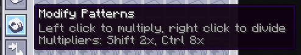
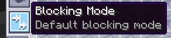

---
navigation:
  parent: expandedae-index.md
  title: QoL機能
  icon: expandedae:exp_pattern_provider
  position: 10
categories:
  - expandedae
---

# QoL機能
## このMODは、以下にリストされているすべてのQoL機能を追加します。
## パターンプロバイダーのパターン乗算: パターンプロバイダーにボタンを追加し、含まれるすべてのパターンを乗算または除算できるようにします。
__乗数はスタックします！__

## 追加のブロックモード: これにより、すべてのパターンプロバイダーに2つの追加のブロックモードが追加されます。
### デフォルト: これはAE2によるデフォルトのブロックモードです。接続されたストレージにこのパターンプロバイダーのパターン入力が含まれていない場合はパターンをプッシュし、ストレージにパターン入力ではないものが含まれている場合は、ブロックモードによってそれがスキップされてパターンがプッシュされます。
    

### フル: このブロッキング モードでは、接続されたストレージに何かが含まれている場合、パターンはプッシュされません。 
    

### スマート:ターゲットストレージにこの特定のパターンからの入力のみが含まれている場合、パターンプロバイダーが同じパターンをプッシュできるようにします。

